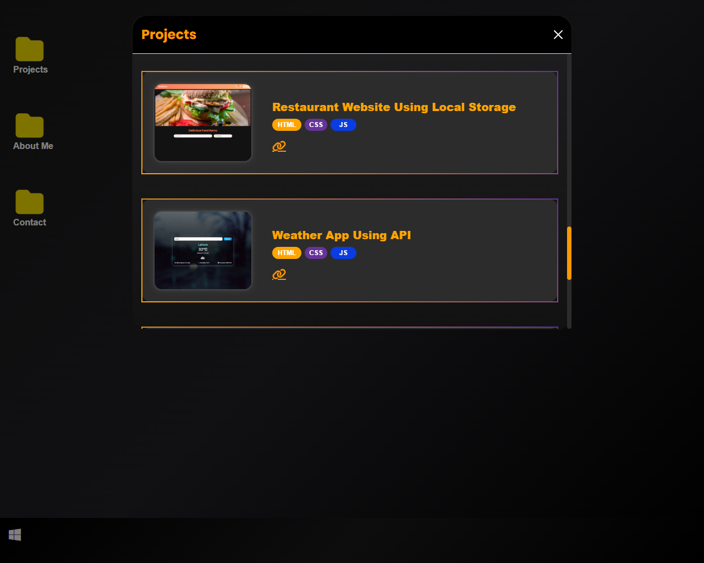

# 🖥️ Windows Themed Portfolio  

  

This is a **Windows OS inspired portfolio website** built using **HTML, CSS & JavaScript**. It replicates the look and feel of a Windows desktop with folders, icons, and a taskbar.  

---

## ✨ Features  
- Windows-like **desktop interface**  
- **Folders and icons** to showcase projects & skills  
- Fully **responsive design** (works on mobile and desktop)  
- Smooth animations and clean UI  

---

## 🚀 Live Demo  
🔗 [View Live Portfolio](https://arijbaig547.github.io/Portfolio/)  

 

---

## 🛠️ Tech Stack  
- **HTML5**  
- **CSS3 (Flexbox & Grid)**  
- **Vanilla JavaScript**  

---

## 📸 Screenshots  

  

---

## 📂 Project Structure  
├── index.html
├── style.css / css folder
├── script.js / js folder
├── screenshot.png (main screenshot)
├── screenshot2.png (extra screenshot)
├── assets/ (icons, images, etc.)
└── README.md
